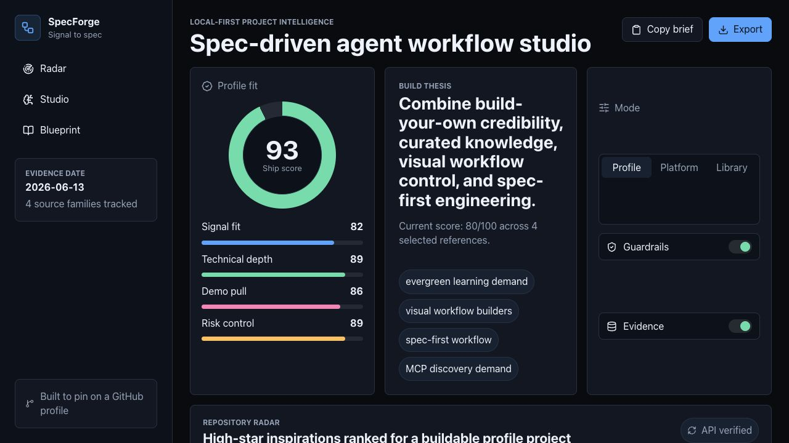

# SpecForge

SpecForge is a local-first workflow studio for turning open-source trend evidence into a spec-driven portfolio project.

It was designed as a GitHub-profile piece: polished enough to demo, technical enough to inspect, and grounded in current high-star project patterns instead of generic app ideas.

**Live demo:** https://nripankadas07.github.io/specforge/



## Best Reasons To Star

Star SpecForge if you want a compact, inspectable example of:

- turning OSS trend evidence into product direction without runtime scraping;
- ranking project inspirations with a transparent scoring model;
- simulating a guarded spec-first workflow before building;
- exporting a README-ready blueprint from product and engineering signals;
- building a polished React/TypeScript portfolio project with tests and CI.

## Why This Exists

The highest-signal repositories I verified on 2026-06-13 cluster around four durable ideas:

- Build-your-own learning and technical depth.
- Curated developer knowledge and awesome-list discovery.
- Visual AI workflow builders and agent orchestration.
- Spec-driven development, guardrails, and MCP-style tooling.

SpecForge combines those ideas into a runnable product: pick high-signal inspirations, simulate a spec-first build workflow, inspect confidence and risk, then export a README-ready blueprint.

## Features

- Trend radar backed by a fixed, source-linked dataset of high-star GitHub repositories.
- Repository scoring engine that weighs stars, technical depth, demo appeal, feasibility, moat, and risk.
- Interactive workflow graph with deterministic event simulation.
- Guardrail and evidence toggles that change the ship score and node status.
- Exportable Markdown blueprint for project planning or README drafts.
- Pure TypeScript scoring and workflow modules covered by Vitest tests.
- Responsive dashboard UI with real repository avatars and no API key requirement.

## What To Inspect First

| Layer | File | Why It Matters |
|---|---|---|
| Evidence dataset | [src/data/repositories.ts](src/data/repositories.ts) | Fixed, source-linked project signals keep demos stable and reviewable. |
| Scoring model | [src/lib/scoring.ts](src/lib/scoring.ts) | Converts stars, technical depth, demo appeal, feasibility, moat, and risk into a portfolio score. |
| Workflow engine | [src/lib/workflow.ts](src/lib/workflow.ts) | Generates deterministic workflow nodes, events, risks, confidence, and ship score. |
| Blueprint export | [src/lib/exporters.ts](src/lib/exporters.ts) | Produces a Markdown project plan from the selected evidence and workflow. |
| Product shell | [src/App.tsx](src/App.tsx) | Wires the dashboard, selectors, graph, event timeline, and export flow. |

## Tech Stack

- React 19
- TypeScript 6
- Vite 8
- Vitest
- Lucide React

## Quick Start

```bash
npm install
npm run dev
```

Quality gates:

```bash
npm run lint
npm run test
npm run build
```

## Architecture

```text
src/
  data/
    repositories.ts      verified source dataset
  lib/
    scoring.ts           portfolio scoring and ranking logic
    workflow.ts          deterministic workflow simulator
    exporters.ts         Markdown export utilities
  App.tsx                product shell and interaction wiring
  App.css                dashboard visual system
```

Read more in [docs/ARCHITECTURE.md](docs/ARCHITECTURE.md).

## Research Sources

- GitHub high-star baseline: https://api.github.com/search/repositories?q=stars:%3E100000&sort=stars&order=desc
- GitHub AI repository query: https://api.github.com/search/repositories?q=topic:ai%20stars:%3E20000&sort=stars&order=desc
- GitHub MCP repository query: https://api.github.com/search/repositories?q=topic:mcp%20stars:%3E5000&sort=stars&order=desc
- GitHub Trending: https://github.com/trending
- OSSInsight AI trending: https://ossinsight.io/trending/ai
- Hacker News spec-driven workflow discussion: https://news.ycombinator.com/item?id=48413629
- Hacker News composable agent discussion: https://news.ycombinator.com/item?id=47350516

Details are in [docs/RESEARCH.md](docs/RESEARCH.md).

## Community And Roadmap

Discussions are open for scoring ideas, workflow suggestions, and project
planning use cases: https://github.com/nripankadas07/specforge/discussions

High-value next improvements:

- add scoring profiles for backend, AI, data, and frontend portfolios;
- add a CLI exporter for generating blueprints from a checked-in config;
- add an optional live GitHub fetcher with cached fallback data;
- add repeatable screenshot and demo-video generation;
- publish example blueprints for real portfolio projects.

The public launch kit is in [docs/LAUNCH_KIT.md](docs/LAUNCH_KIT.md).

## Project Standard

SpecForge is intentionally local-first. It does not call LLM APIs, scrape live social media, or require credentials at runtime. The repository data is fixed inside the app so demos are stable, repeatable, and reviewable.

## License

MIT
